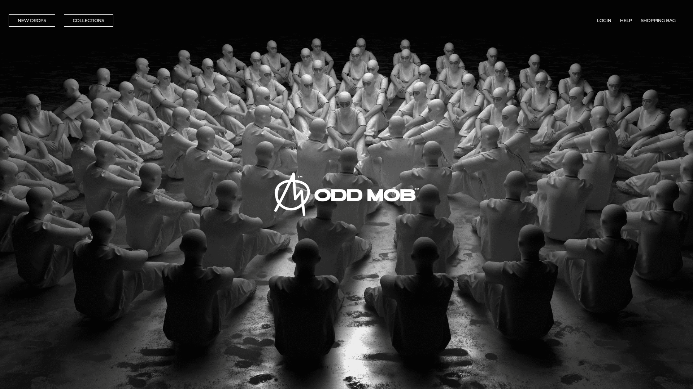
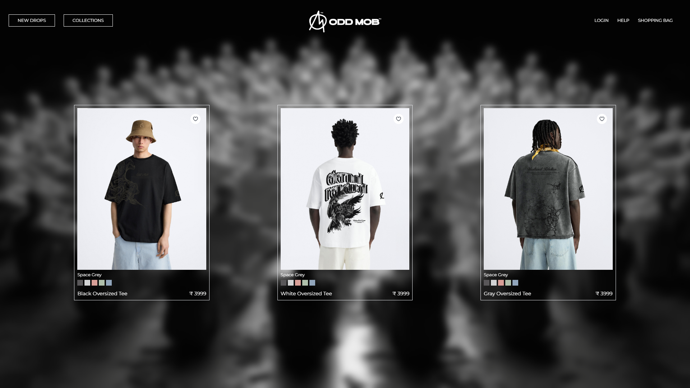
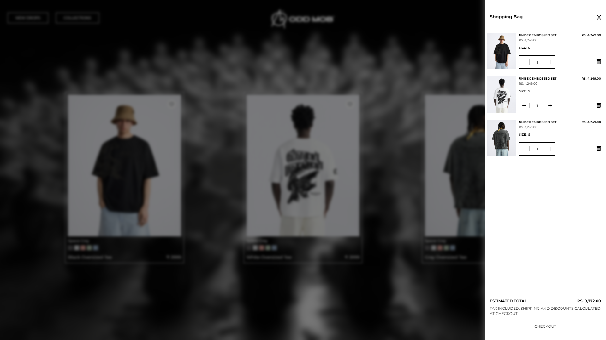

# OddMob.In - Premium Cloth Shopping Brand

## [Visit Website Here..](https://oddmob.in)



---



---



Welcome to the **OddMob** repository. This project is an e-commerce platform for shopping high-quality, premium clothing. The website is built using modern web technologies, ensuring a seamless and responsive user experience.

## Project Overview

### Features

- **User Authentication**
  - Secure sign-up and login functionality
  - User profile management

- **Product Listings**
  - Browse premium clothing items with detailed descriptions and high-quality images
  - Filter and sort products by categories, sizes, and prices

- **Shopping Cart**
  - Add, update, and remove items from the cart
  - View cart summary and total price

- **Checkout Process**
  - Smooth and secure checkout flow
  - Integration with payment gateways

- **Order Management**
  - View past orders and order details
  - Track order status

### Technology Stack

#### Frontend

- **React:** A JavaScript library for building user interfaces.
- **Tailwind CSS:** A utility-first CSS framework for rapid UI development.

#### Backend

- **Node.js:** A JavaScript runtime for server-side programming.
- **Express:** A web application framework for Node.js.

### Prerequisites

- Node.js
- npm (Node Package Manager)

## Installation

### Backend Setup

1. Clone the repository:

    ```bash
    git clone https://github.com/ABHISHEK-SIN-GH/ODD-MOB.git
    ```

2. Navigate to the backend directory:

    ```bash
    cd premium-cloth-shopping-website/backend
    ```

3. Install the required packages:

    ```bash
    npm install
    ```

4. Start the backend server:

    ```bash
    npm start
    ```

### Frontend Setup

1. Navigate to the frontend directory:

    ```bash
    cd ../frontend
    ```

2. Install the required packages:

    ```bash
    npm install
    ```

3. Start the frontend development server:

    ```bash
    npm start
    ```

## Usage

1. Navigate to `http://localhost:3000` in your browser.
2. Sign up or log in to your account.
3. Browse and shop for premium clothing items.

## License

This project is licensed under the MIT License.

## Contact

For any inquiries or feedback, please contact us at [singh.abhishek151019@gmail.com](mailto:singh.abhishek151019@gmail.com).

---

Happy shopping! 👗👔👕
